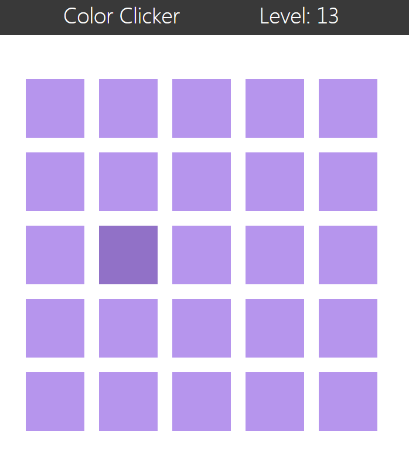

Dieses Javascript-Spiel stellt eine Re-Implementierung von Peter Lauris Spiel [Color Picker](https://gamejolt.com/games/color-picker/35110) dar. Der Aufbau der Anwendung soll Ihnen das Prinzip der modularen Entwicklung mit Javascript, den Einsatz von Listener zur asynchronen, event-basierten Kommunikation innerhalb Ihrer Anwendungen sowie ein grundlegendes Verstädnis vom MVC-Prinzip vermitteln.

