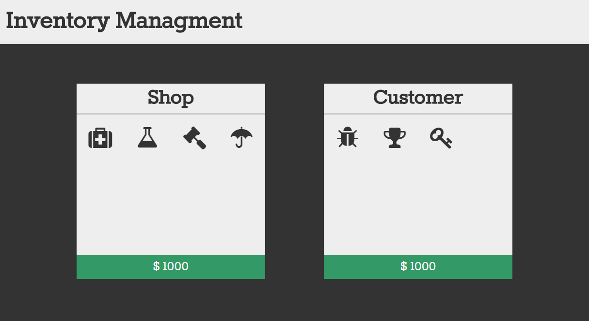

Diese Javascript-Anwendung simuliert eine Handelssituation in einem typischen RPG-Spiel. Gegenstände können zwischen den Inventaren des Ladenbesitzers und des Kunden ausgetauscht werden um Ein- und Verkäufe zu simulieren. Dabei können die einzelnen *Items* per Drag & Drop zwischen den beiden Personen hin- und hergeschoben werden. Die Gegenstände werden visuell in das jeweils andere Inventar überführt und der Kontostand der beiden Parteien wird automatisch angepasst.

