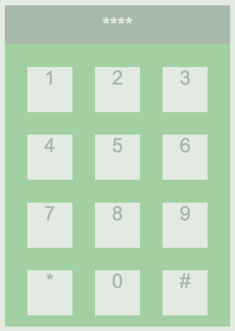
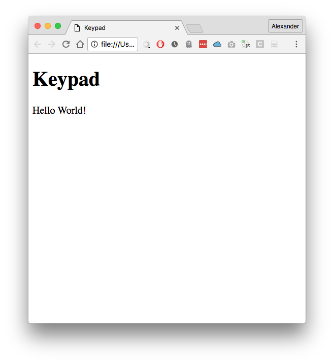
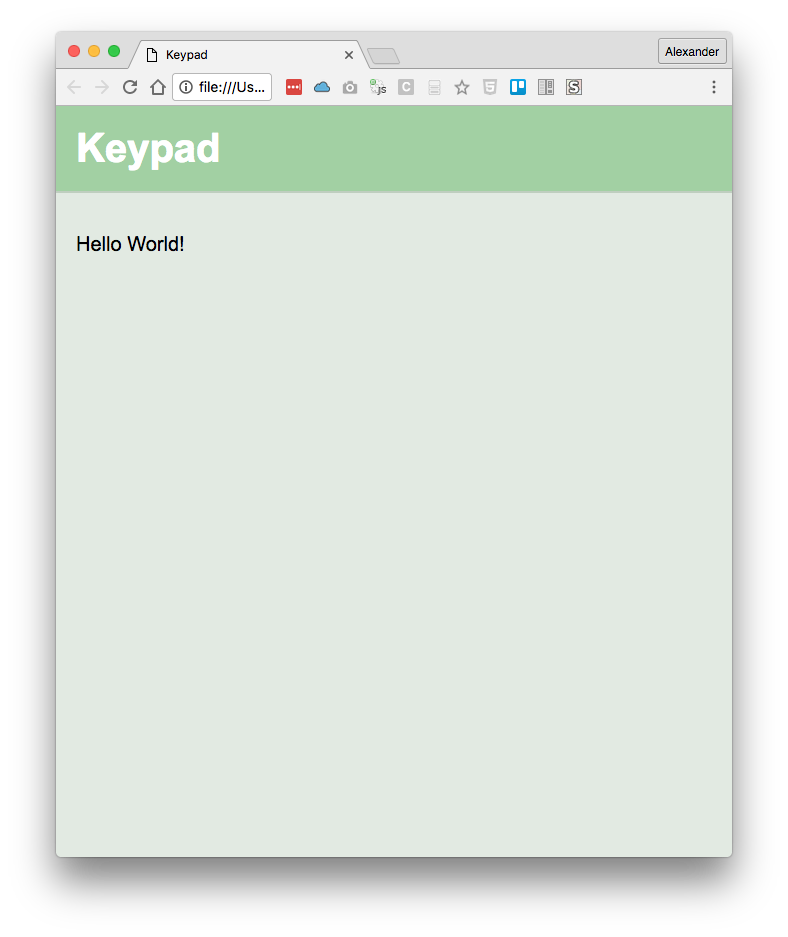
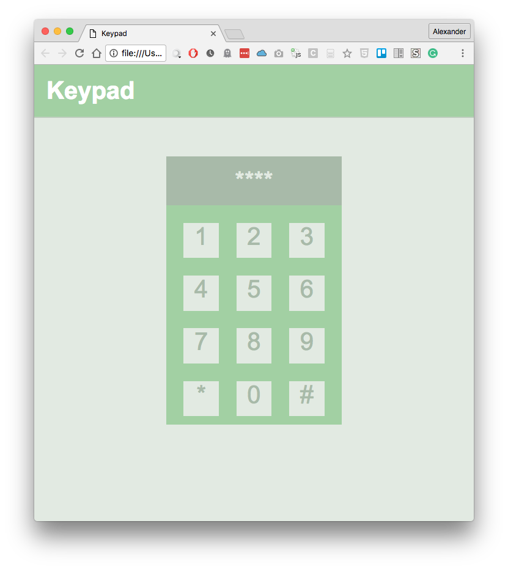

In dieser Demo lernen Sie die grundlegenden Schritte kennen um eine einfache Javascript-Anwendung für den Browser zu erstellen. Dieses Tutorial ersetzt keine eigene Beschäftigung mit den Grundlagen zu HTML, CSS und Javascript. Sollten Sie auf diesen Gebieten noch Bedarf an weiteren Materialien zum Selbststudium haben, finden Sie entsprechenden Links im [GRIPS-Kurs](https://elearning.uni-regensburg.de/course/view.php?id=26759). 

__Das Keypad__  
In dieser Demo erstellt wir ein interaktives *Keypad*, mit dem der Nutzer Zahlencodes eingeben kann. Die Strukturelemente des *Keypads* werden durch HTML erstellt. Die korrekte Darstellung wird durch den Einsatz von CSS realisiert. Für die Programmlogik, d.h. für das Verarbeiten der Benutzerinteraktion sowie für die interne Überprüfung des eingegebenen Codes wird Javascript verwendet.

* Das *User Interface* besteht aus einem Display zur Anzeige der eingegebenen Zahlenfolge. Vor und nach der Eingabe wird in diesem Feld die Zeichenkette `****` eingeblendet. 
* Zusätzlich stehen dem Nutzer 12 Tasten zur Verfügung mit denen er die Ziffern 0 bis 9 eingeben kann. Über die Taste `*` kann der Benutzer die aktuelle Eingabe aus dem Display löschen. Über die Taste `#` bestätigt er die Eingabe, was zur Überprüfung des Codes führt. 
* Wird der korrekte Code eingeben, erscheint in der *Konsole* die Ausgabe `Code Accepted!`, andernfalls wird `Invalid Code` ausgegeben. In beiden Fällen wird anschließend das Display zurückgesetzt.



Die Beschreibung ist in sieben Abschnitte unterteilt. In jedem dieser Schritte wird das Projekt erweitert um schließlich den oben beschriebenen Funktionsumfang zu realisieren. Sie können die verschiedenen Schritte nachvollziehen (und nach-programmieren) in dem Sie die jeweils passenden *Commit* auschecken und sich dadurch jeweils den zum aktuellen Schritt zugehörigen Stand des Codes anschauen.

## Ausgangslage und Projektstruktur
[Stand des Repositories nach diesem Schritt](https://github.com/Multimedia-Engineering-Regensburg/Demo-01-Keypad/tree/4a1d493f2dc53e3cb1d97c35c549a4f4dacf96eb)  
In diesem Schritt wird die Projektstruktur mit den wichtigsten Verzeichnissen und Dateien angelegt. Grundsätzlich bleibt es Ihnen selbst überlassen, wie Sie Ihren Code organisieren. Es gibt jedoch einige *Best Practices* bezüglich der Benennung und Sortierung der Ordner, die von vielen Entwicklern verwendet werden. Ein wichtiges Ziel ist es dabei, den eignen Code von möglicherweise verwendeten externen Bibliotheken oder APIs zu trennen und die Ressourcen des Projekts logisch und inhaltlich strukturiert abzubilden.  

### Ordnerstruktur
In diesem Kurs verwenden wir in den meisten Fällen die folgende Ordnerstruktur. Der Vorschlag entstammt einem [Beitrag auf stackoverflow.com](http://stackoverflow.com/a/24199418), wo Sie auch eine detaillierter Beschreibung zu den einzelnen Ordnern finden. In dieser - und einigen anderen Demos - finden Sie unter Umständen eine einzelne Datei `.gitkeep` in der vorgegebenen Ordnerstruktur. Das im Kurs verwendete Versionsverwaltungssystem [GIT](https://git-scm.com/) ignoriert leere Ordner. Um diese trotzdem unter Versionskontrolle zu halten kann eine versteckte Datei angelegt werden, die dann - zusammen mit der übergeordneten Ordnerstruktur - ge*trackt* wird. Als [Konvention](http://stackoverflow.com/questions/7229885/what-are-the-differences-between-gitignore-and-gitkeep) für diese Datei hat sich der Name `.gitkeep` entwickelt. 

```html
index.html
vendors     -> external libraries
|____ one-folder-per-library
resources   -> project files
|____ css
|   |____ one-file-per-theme
|   |____ one-folder-per-theme
|       |____ theme-specific-css-images
|   |____ shared-css-images
|____ images  -> images used in app
|____ data    -> data used in app
|____ js  -> source code
```   

Im vorliegenden Projekt finden Sie auf oberste Ebene die Datei `index.html`. In dieser Datei bilden wir die Struktur unserer Anwendung bzw. deren *User Interfaces* als HTML-Dokument ab. Die Datei dient als Einstiegspunkt für die Anwendung, in dem Sie bewusst im Browser geöffnet wird oder durch einen Server ausgeliefert wird. Im späteren Verlauf werden hier die Verweise zu den CSS- und Javascript-Dateien eingefügt, damit diese durch den Browser bei der Darstellung der HTML-Inhalte berücksichtigt werden.  

Im Ordner `resources` werden alle weiteren, für die Anwendung nötigen, Dateien abgelegt. Unterschieden wird dabei zwischen den Javascript-Dateien im Ordner `js`, den  - hier nicht verwendenten - Bildateien in `images` sowie den für die Gestaltung der Anwendung benötigten CSS-Dateien im Ordner `css`. Dieser Ordner kann weiter unterteilt werden um z.B. unterschiedliche Gestaltungsarten der Anwendung (*Themes*) von einander getrennt zu verwalten.

## Schritt 1: HTML-Code hinzufügen und CSS-Datei verlinken.
[Stand des Repositories nach diesem Schritt](https://github.com/Multimedia-Engineering-Regensburg/Demo-01-Keypad/tree/3169407d9f9bf974d8c927f6670d2d4be92cd17a)

In der HTML-Datei wird der grundlegende Code für die Strukturierung der Anwendung erstellt. Der Inhalt der Datei unterteilt sich dabei grundlegend in einen `head`-Bereich mit Meta-Informationen und einem `body`-Bereich mit den eigentlichen sichtbaren Inhalten. Im ersten Schritt wird mit dem HTML-Element `header` ein Bereich zur Anzeige des Anwendungstitels erstellt. Zusätzlich wird das `content`-Element eingefügt, dass vorerst nur den Text `Hello World!` darstellt. Anschließen wird die - noch leere - CSS-Datei im `head`-Bereich verlinkt. Durch das eingefügte `link`-Element wird dafür gesorgt, dass der Browser beim Rendern der HTML-Inhalte die in der Datei `default.css` hinterlegten CSS-Regeln zur Gestaltung der Elemente berücksichtigt.  

Da aktuell noch keine CSS-Regeln definiert werden, wird der eben erstellte HTML-Inhalt ohne spezifische Gestaltung angezeigt:



## Schritt 2: Einfaches CSS-Styling für die Website hinzufügen.
[Stand des Repositories nach diesem Schritt](https://github.com/Multimedia-Engineering-Regensburg/Demo-01-Keypad/tree/02d2e426cd633b8695c22fe40bb98c5ce71517cb)

In diesem Schritt werden mehrere CSS-Regeln erstellt, um eine rudimentäre Gestaltung der Anwendung zu realisieren. Zusätzlich wird in der HTML-Datei der Titel der Anwendung durch das Hinzufügen einer entsprechenden CSS-Klasse spezifiziert. Diese Veränderung hat keine Auswirkung auf die HTML-Struktur, kann aber in der CSS-Datei dazu genutzt werden, das spezifische Element mittels eines Selektors leichter zu beschreiben und damit dessen Gestaltung zielgerichtet zuzuordnen.  

In der CSS-Datei werden Regeln für das `html`, `body`-, `header`- und das `content`-Element erstellt. Verschieden CSS-Eigenschaften sorgen dafür, dass die Elemente spezifisch positioniert und gestaltet werden.

Nach diesem Schritt wird die Anwendung im Browser wie folgt dargestellt:

 

## Schritt 3: HTML-Struktur für das Keypad hinzufügen.
[Stand des Repositories nach diesem Schritt](https://github.com/Multimedia-Engineering-Regensburg/Demo-01-Keypad/tree/ce168536bcdeeb91b372fee37c011578075f337c)

Die HTML-Datei wird erweitert um die Struktur des *Keypads* abzubilden. Dabei wird die hierarchische Struktur von HTML verwendet, um die Relationen der einzelnen Bestandteile der Anwendung bzw. des dargestellten *Keypads* möglichst genau abzubilden. Neben der strukturellen Anordnung dienen CSS-Klassen der semantischen Spezifizierung der verschiedenen Elemente. Die tatsächlich dargestellten Inhalte oder Texte der verschiedenen Bestandteile des *Keypads* werden als Inhalte der entsprechenden HTML-Elemente eingefügt. Zusätzlich dienen `data-`-Attribute der Speicherung weiterer Element-spezifischer Informationen.

Für die Darstellung der Inhalte werden die folgenden HTML-Elemente genutzt:

* ```<div cass="keypad-container"></div>```: Dieser Container umschließt alle weiteren Bestandteile des *Keypads*.
* ```<div cass="display"></div>```: Dieses Element bildet den Bildschirm des *Keypads* ab.
* ```<div cass="keypad"></div>```: Dieses Element bildet das eigentliche Tastenfeld ab, mit dem der Nutzer interagiert. Die einzelnen Tasten werden als Kinderelemente abgebildet.

* ```<span cass="key"></span>```: Jede Taste wird als eigenständiges Element abgebildet. Der Taste wird zur Darstellung als Inhalt des Elements und zur internen Verwendung innerhalb der Anwendung als `data-value` gespeichert.

 

## Schritt 4: CSS-Styling für Keypad hinzufügen.
[Stand des Repositories nach diesem Schritt](https://github.com/Multimedia-Engineering-Regensburg/Demo-01-Keypad/tree/ad837714012bf552cbf7df985e1f5155e04cda58)

Die im vorherigen Schritt angelegte Struktur muss um CSS-Regeln ergänzt werden, um die Darstellung des *Keypads* zu erreichen. Dazu werden für die verschiedenen Bestandteile (Container, Display, Tasten) unterschiedliche Regeln erstellt, die durch das Setzen der Position, Größe, Farbe und Schrifteinstellungen das gewünschte Endergebnis erzielen. 

 

## Schritt 5: Javascript-Datei in der HTML-Datei referenzieren.
[Stand des Repositories nach diesem Schritt](https://github.com/Multimedia-Engineering-Regensburg/Demo-01-Keypad/tree/05075d3ba1665ed417876f5c6af33ba886216cd4)

Um unsere Anwendung durch Javascript zu erweitern, müssen wir den entsprechenden Code durch den Browser ausführen lassen. Anstatt die Anweisungen direkt im HTML-Dokument zu notieren, werden wir den benötigten Quellcode in eine zusätzliche Datei auslagern. Um dem Browser mitzuteilen, dass beim Laden der Anwendung der Inhalt dieser Javascript-Datei ausgeführt werden soll, muss eine Verbindung zwischen HTML-Dokument und Javascript-Datei aufgebaut werden. Dies geschieht ähnlich wie beim Referenzieren der CSS-Datei, durch das Einfügen eines `<script>`-Tags. Der angebenen Link im `src`-Attribut verweist dabei auf unsere Code-Datei. Die dort gespeicherten Javsascript-Anweisungen werden vom Browser an der Stelle der Einbindung ausgeführt.

## Schritt 6: Implementierung für das Keypad-Objekt hinzufügen.
[Stand des Repositories nach diesem Schritt](https://github.com/Multimedia-Engineering-Regensburg/Demo-01-Keypad/tree/a30cfc88a9e7a7efa2d4a9da5063ef112e6ad4d2)


[folgt]

## Schritt 7: Keypad-Objekt in eine wiederverwendbare Form mit Listener umbauen
[Stand des Repositories nach diesem Schritt](https://github.com/Multimedia-Engineering-Regensburg/Demo-01-Keypad/tree/411fc5a577de1570142443d2e66ccf902a713a7d)

[folgt]

