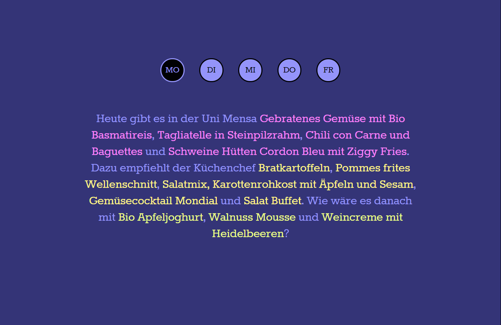

Mit dieser Javascript-Anwendung können Nutzer das aktuelle Tagesmenü der Universitäts Mensa in Textform einsehen. Der Benutzer kann die einzelnen Tage der aktuellen Woche anwählen und erhält jeweils einen generierten Text, der die Vor-, Haupt- und Nachspeisen sowie die Beilagen beschreibt, die an dem jeweiligen Tag in der Mena erhältlich sind. Die Daten werden beim Anwendungstart per AJAX nachgeladen. Als Bezugsquelle dient eine entsprechende [API](http://132.199.139.24/~baa56852/www/mensa/), die die Speisepläne der aktuellen Woche im JSON-Format anbietet.

