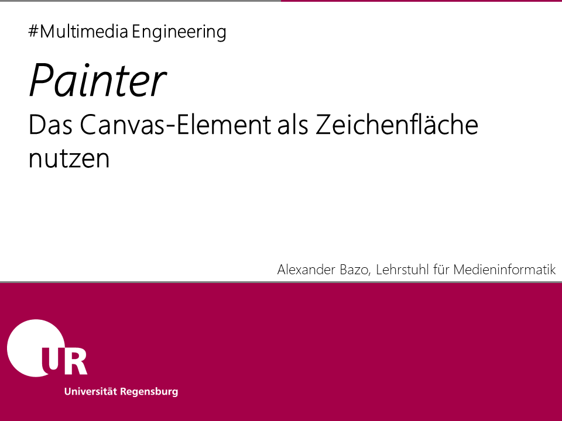
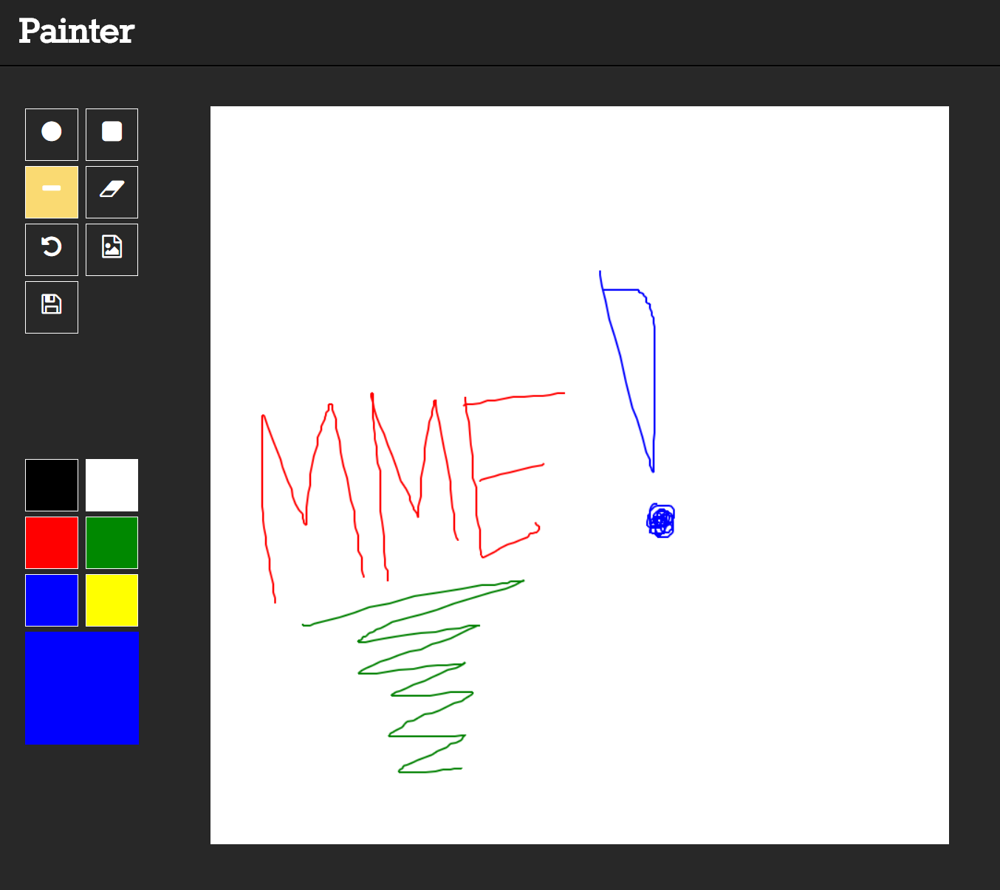

Dieses Anwendungsbeispiel implementiert ein rudimentäres Zeichenprogramm für den Browser. Basierende auf dem Canvas-Element stellt es dem Nutzer elementare Funktionen zum Freihandzeichnen mit verschiedenen Farben und Formen bereit. Die Exportfunktionen des Canvas werden genutzt um die erstellten Zeichnungen als herunterladbares Bild zu speichern. Die Anwendung erlaubt das schrittweise Rückgängigmachen aller erfolgten Zeichenoperationen.

