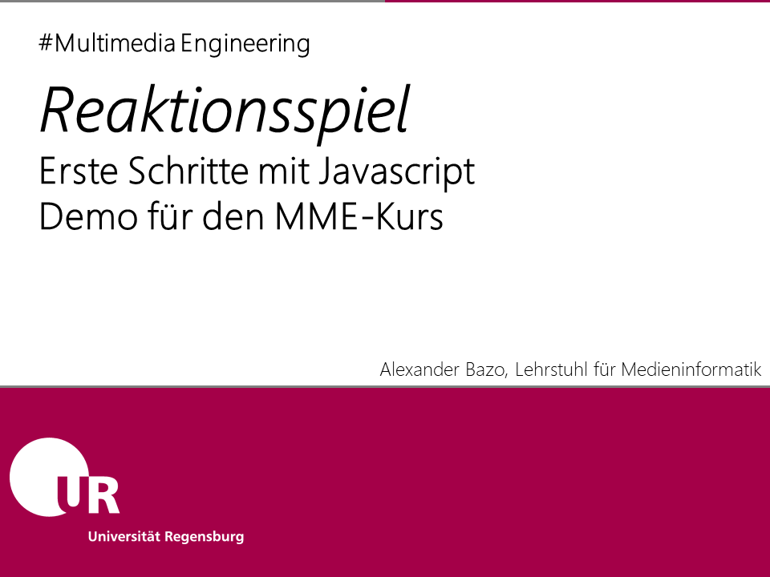
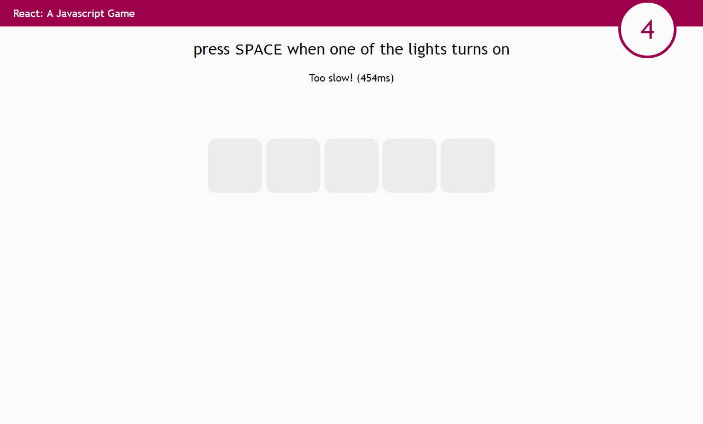

# Reaktionsspiel mit Modulen

In diesem Javascript-Spiel muss der Spieler die Leertaste möglichst schnell drücken, nachdem eines von fünf sichtbaren Elementen die Farbe gewechselt hat. Reagiert der Spieler schnell genug, erhält er einen Punkt. Drückt er die Leertaste ohne das ein Farbwechsel stattgefunden hat, wird ein Punkt abgezogen. Das User Interface zeigt einen Anleitungstext, den aktuellen Punktestand und die fünf Elemente an, von denen ein zufällig ausgewähltes nach einer zufällig bestimmten Zeit die Farbe wechselt. Zusätzlich wird nach dem Betätigen der Leertaste ein Feedbacktext angezeigt.

## Vorbemerkungen

Diese Demo dient der Einführung des [_Revealing Module Patterns_](https://addyosmani.com/resources/essentialjsdesignpatterns/book/#revealingmodulepatternjavascript) als zentralem Architekturparadigma für die Programmbeispiele und Übungsaufgaben in diesem Kurs. Im Rahmen dieses überschaubaren Beispiels kann die Verwendung dieses Musters möglicherweise übertrieben wirken (wir benötigen mehr Code als im ursprünglichen Beispiel), im Vordergrund sollte aber die Betrachtung der Möglichkeiten stehen, mit diesem _Pattern_ unabhängige, voneinander isolierte Komponenten zu erzeugen auf deren Basis unsere Anwendungen strukturiert und abstraktere Muster wie z.B. das bekannte _Model View Controller_-Pattern implementiert werden können.

## Beschreibung der Modulstruktur

In dieser alternativen Lösung der Demo werden Module zur Strukturierung des Code genutzt, der hier in Anlehnung an das [_MVC_-Prinzip](https://en.wikipedia.org/wiki/Model%E2%80%93view%E2%80%93controller) entworfen wurde. Die ursprünglich in einer einzelnen Datei implementierte Logik der Anwendung wird auf drei Teilbereiche aufgeteilt: Die Manipulation des _User Interfaces_ erfolgt im `GameView`, die komplette Spiellogik wird - losgelöst von der Benutzerschnittstelle - im `GameModel` abgebildet, das hier zwar vor allem die Spielmechanik abbildet, indirekt aber dadurch auch den _State_ der Anwendung verwaltet und somit Aufgaben eines klassischen _Models_ innerhalb der MVC-Struktur übernimmt. Das Modul `ReactionGame` dient als zentrale Komponente der Anwendung zur Initialisierung des Spiels und zur Steuerung der Kommunikation zwischen den anderen beiden Modulen, die isoliert voneinander arbeiten und daher keine direkte Schnittstelle zueinander aufweisen. Teilweise übernimmt dieses zentrale Modul Aufgaben eines _Controllers_, hat hier aber weitergehende Aufgaben.

## Konstruktion der Module und dateiübergreifende Verwendung

Alle Komponenten dieses Projekts werden durch den Einsatz von _Closures_ als _Revealing Modules_ angelegt, die jeweils über ein als Rückgabewert der Konstruktionsfunktion nach Außen gegebenes Schnittstellenobjekt einen Teil ihrer Funktionalitäten als Funktionsreferenzen offenlegen (Nicht zutreffenden aber passende Analogie: `public`-Modifikator in Java). Der interne Bereiche der Funktionen ist dabei vom Rest der Anwendung geschützt (Funktionseinschlüsse, nicht zutreffenden aber passende Analogie: `private`-Modifikator in Java). Die drei Module werden in separaten Dateien eingebunden, die einzeln im HTML-Dokument eingebunden werden. Als verbindendes Element dient dabei der globale Kontext der Javascript-Anwendung. Um diesen nicht unnötig mit Variablen zu befüllen wird die in `ReactionGame.js` erzeugte, globale Variable `ReactionGame` als sogenannter _Namespace_ verwendet, der in `ReactionGameView.js` bzw. `ReactionGameModel.js` zum Speichern der Konstruktionsfunktionen der beiden jeweiligen Module genutzt wird. Anders als beim zentralen Modul `ReactionGame` werden bei diesen Modulen zuerst nur die Konstruktionsfunktionen angelegt und im _Namespace_ gespeichert, um dann - bei der Initialisierung der Anwendung - zur Konstruktion der Module verwendet zu werden. Das Schlüsselword `new` ist hier optional und kann weggelassen werden. Es unterstreicht jedoch die hier stattfindende Konstruktion des Moduls. Das zentrale Module `ReactionGame` wird unmittelbar beim Einlesen der Datei `ReactionGame.js` erzeugt (Siehe dazu: Aufruf der angelegten Funktion noch auf der rechten Seite der Zuweisung, `ReactionGame.js` (Zeile 3-66)).

## Kommunikation zwischen `Reaction Game` und `ReactionGameModel`

Die Kommunikation dem zentralen Modul `ReactionGame` und dem `GameModel` erfolgt auf der einen Seite über direkte Methodenaufrufe sowie auf der anderen Seite durch ein rudimentär implementiertes _Listener_-Muster. Über den direkten Aufruf der Methoden `start`, `stop` und `handleUserInput` startet/stoppt das zentrale Modul die Spiellogik bzw. informiert das Model über den erfolgten Tastendruck. Informationen aus dem Model heraus werden per _Events_ kommuniziert. Das Model stellt dabei ein _Observable_ da, das über die öffentliche Methode `addEventListener` die Registrierung von _Callbacks_ bzw. _Listeners_ erlaubt. Das zentrale Modul `ReactionGame` ist in diesem Fall der _Observer_, der auf die Ereignisse des Models lauscht. Innerhalb des Models werden die registrierten _Callback_-Methoden in Arrays gespeichert, die über den Event-Typen eindeutig identifizierbar sind. Tritt ein Ereignis ein, wird die Liste der gespeicherten Callbacks für dieses Ereignis iteriert, jede Methode wird - ggf. mit zusätzlichen Parametern - aufgerufen. Die hier gewählte Implementierung ähnelt dabei der Referenzimplementierung aus dem [Mozilla Developer Network](https://developer.mozilla.org/de/docs/Web/API/EventTarget).