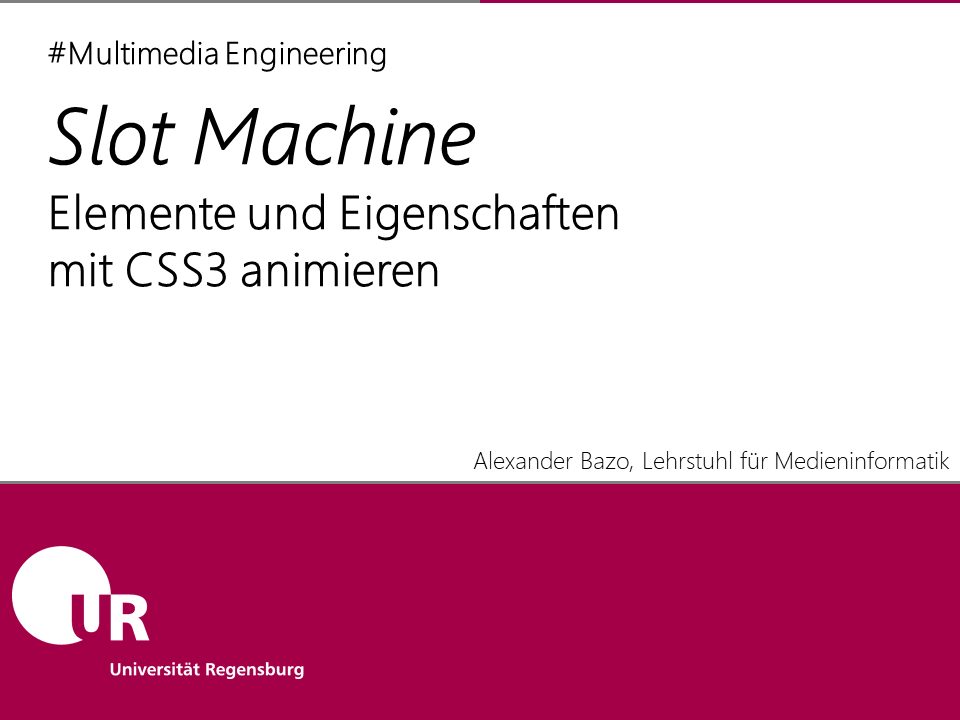
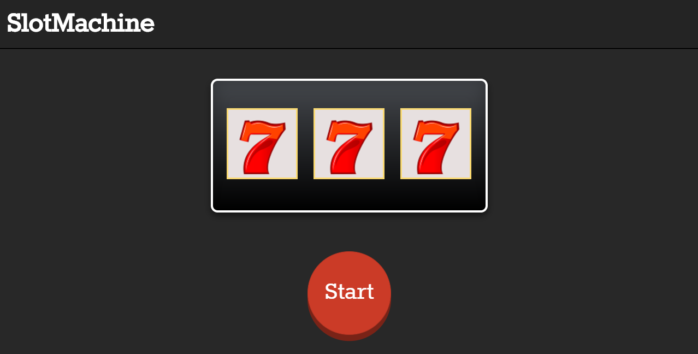

Dieses Anwendungsbeispiel implementiert eine virtuelle *Slot Machine*, einen einarmigen Banditen. Zur Visualisierung der Bewegungen der einzelnen Walzen werden CSS3-Animationen verwendet. Das Auslösen und Steuern der Animation erfolgt im Javascript.

