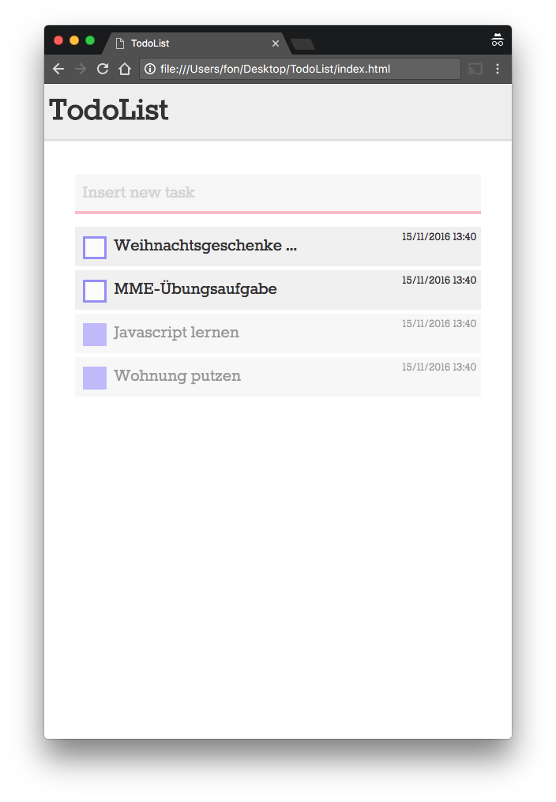

# Todo-Liste: Daten im Browser persistieren

Mit diesem Beispiel können Sie die Möglichkeiten zur persistenten Speicherung von Anwendungsinformationen im Browser anhand eines realen Anwendungsbeispiels nachvollziehen. Die hier implementierte *Todo*-Liste erlaubt dem Nutzer das Erstellen und Abspeichern von Aufgaben. Die erstellten *Tasks* bleiben über mehrere *Browser-Sessions* erhalten. Einzelne Aufgaben können als *erledigt* markiert werden, was Auswirkungen auf die Darstellung und Positionierung im *User Interface* hat. Der *erledigt*-Zustand einer Aufgabe kann zurückgesetzt werden. Aufgaben werden mit einer beim Erstellen anzugebenden Beschreibung sowie dem Erzeugungsdatum in der Liste angezeigt.

## Motivation

Eine *Todo*-Liste stellt ein gutes Beispiel für eine Anwendung dar, die Nutzer-spezifischen Daten persistent speichern muss. Eine solche Anwendung wird von potenziellen Nutzer mehrfach verwendet werden und die erstellten Informationen sind über eine einzelne Session hinaus relevant. Dementsprechend besteht die Notwendigkeit, die anfallenden Daten so zu speichern, dass diese beim nächsten Anwendungsstart erneut zur Verfügung stehen und einem spezifischen Nutzer zugeordnet werden können. 

## Daten in Webanwendungen speichern

Ist es im Rahmen einer Webanwendung notwendig, Daten dauerhaft und *Session*-übergreifend zu speichern, so sind grundsätzlich zwei verschiedene Strategien zu unterscheiden. Die anfallenden Daten können entweder auf einem zentralen Server oder lokal auf dem System des Nutzers gespeichert werden.

1. **Severseitige-Speicherung**: Werden die Daten auf einem zentralen Server gespeichert und benutzerspezifisch bereitgestellt, kann eine bestmögliche Portabilität der Anwendung gewährleistet werden. Über eine notwendige Schnittstelle und entsprechende Authentifizierungsmechanismen kann die lokale Client-Anwendung Informationen anfordern und anzeigen. Dabei ist die Verfügbarkeit der Daten unabhängig von dem System auf dem die Client-Anwendung ausgeführt wird. Dieser Ansatz setzt eine entsprechende Infrastruktur und eine - möglicherweise komplexe - Schnittstelle zwischen Client und Server voraus.
2. **Clientseitige-Speicherung**: Alternativ können Daten auf dem Client-System gespeichert werden und bei der nächsten Session durch die Client-Anwendung geladen und bereitgestellt werden. Im Gegensatz zur serverseitigen Speicherung ist die notwendige Infrastruktur hier in der Regel weniger komplex. Eine einheitliche und konsistente Verwendung der Anwendung durch den gleichen Nutzer auf unterschiedlichen Systemen ist aber weniger leicht zu realisieren. Zusätzlich kann der gewählte Ansatz zum Speichern der Daten zu - technologiebedingten - Einschränkung im Umfang und der Komplexität der speicherbaren Inhalte führen.

### Daten im Browser speichern

Im Kontext moderner Webbrowser haben Sie die Möglichkeit Anwendungs- bzw. Websitespezifische Daten persistent zu speichern. Im wesentlichen stehen Ihnen aktuell dazu zwei Ansätze zur Verfügung:

* [Cookies](https://en.wikipedia.org/wiki/HTTP_cookie) speichern Informationen in separaten, lokalen Dateien, die in die *HTTP-Response* eines Webservers  eingebettet sind und vom empfangenden Browser lokal gespeichert werden. Die gespeicherter Cookies werden vom Browser mit jeder erneuten Anfrage (an die ursprüngliche URL bzw. Domain) zurück an den Server gesendet. Cookies sind im Umfang (`4kb`) und in der Anzahl (max. 50 Cookies pro Domain) stark begrenzt. 
* Die [Web Storage API](https://developer.mozilla.org/en-US/docs/Web/API/Web_Storage_API/Using_the_Web_Storage_API) wird vom Browser bereitgestellt und stellt eine Schnittstelle zum persistenten Speichern von Informationen im Browser zur Verfügung. Über eine Javascript-Implementierung der Schnittstelle kann auf ein URL/*Origin*-spezifisches Objekt zugegriffen werden, dass das Speichern von *Plaintext*-Inhalten ermöglicht. Unterschieden wird dabei zwischen der Session-beschränkten Speicherung im `sessionStorage` und der dauerhaften Speicherung im  `localStorage`. Pro *Origin* können - je nach Browser - zwischen `5 MB` und `25 MB` gespeichert werden.

#### Ansätze zur Nutzung der *Web Storage API* 
Um die Persistenz-Schicht möglichst modular zu gestalten und von der übrigen Programmlogik abzutrennen, empfiehlt es sich, die Berührungspunkte zwischen Ihrer Anwendung und der `Web Storage API` möglichst gering zu halten. Ein guter Ansatzpunkt dazu ist es, den aktuellen Zustand Ihres *Models* bei Bedarf vollständig zu persistieren und beim Start der Anwendung wiederherzustellen. In beiden Fällen muss dabei auf die notwendige Fehlerbehandlung eingegangen werden. Zu beachten ist, dass im *Storage* des Browsers nur Informationen in reiner Textdarstellung gespeichert werden können. Komplexere Javascript-Strukturen müssen also entweder in eine verlustfreie und wiederherstellbare Darstellung (z.B. *JSON*) überführt werden oder im Rahmen der Speicherung und Wiederherstellung entsprechend verarbeitet werden. Besonders wichtig ist es auch, den Zeitpunkt der Speicherung zur Laufzeit so zu wählen, dass der Verlust wichtiger Informationen ausgeschlossen werden kann.

**Für einfache Anwendungen können Sie an diesem Schema orientieren:**

1. Erstellen Sie eine stabile Anwendungsarchitektur, die den Zustand (*State*) Ihrer Anwendung im einem *Model* abbildet. Das *Model* speichert diesen Zustand in Form einer oder mehrere Javascript-Strukturen (Objekte wie z.B. Arrays). Achten Sie dabei darauf, dass die relevanten Datenstrukturen verlustfrei in *JSON* überführt werden können. Ihre Anwendung operiert auf diesen Daten.
2. Speichern Sie den Zustand zur Laufzeit an geeigneten Stellen, indem Sie den aktuellen *State* in eine *JSON*-Repräsentation umwandeln und im `localStorage` speichern.
3. Versuchen Sie beim Anwendungsstart einen gespeicherten Zustand zu laden. Überführen Sie die geladenen Daten in nutzbare Javascript-Strukturen und befüllen Sie Ihr *Model* mit diesen Informationen. Wenn keine Daten gespeichert wurden, stellen Sie einen - leeren - initialen Zustand im *Model* bereit.

## Aufbau der Anwendung


Das *User Interface* der Anwendung besteht aus einem Eingabefeld zur Erstellung neuer Aufgaben sowie einer Liste zur Darstellung der bereits erstellten Aufgaben. Die Liste ermöglicht es dem Nutzer den Zustand einzelner Aufgaben zu ändern.

Die Anwendung ist in drei Module aufgeteilt, die jeweils spezifische Aufgaben erfüllen. Die öffentlichen Schnittstellen zur Verwendung dieser Module sind im Quellcode dokumentiert.

* `TodoList-Model.js`: In diesem Modul wird die Liste der erstellten Aufgaben verwaltet. Es können neue Aufgaben erstellt werden und der Zustand einer Aufgabe (*offen* vs. *erledigt*) kann umgeschaltet werden. Es kann eine Liste aller aktuellen Aufgaben ausgelesen werden. Zusätzlich ist das explizite Speichern des aktuellen Zustands bzw. das Wiederherstellen des gespeicherten Zustands möglich.

* `TodoList-ViewController.js`: Diese Modul erlaubt die Anzeige der Aufgaben im *User Interface*. Die dargestellten Informationen bereits angezeigter Aufgaben können aktualisiert werden. Das Modul verwaltet das Eingabefenster und erlaubt dessen Fokussierung sowie das Löschen von dessen aktuellem Inhalt. Über die öffentliche Schnittstelle des Moduls können sich Listener für zwei Events registrieren: `taskStatusChanged` (wird ausgelöst, wenn der Nutzer den Zustand eines angezeigten Tasks durch Verwendung der *Checkbox* ändert) und `taskDescriptionEntered`(wird ausgelöst, wenn der Nutzer eine neue Aufgabenbeschreibung erstellt hat und die Eingabe mit der Eingabetaste bestätigt hat).

* `TodoList.js`: Das zentrale Modul initialisiert beim Anwendungsstart die übrigen Komponenten. Zusätzlich reagiert es auf die Events, die vom *ViewController* versendet werden und verknüpft damit *Model* und *View*.

### Verwendetet Daten
Die in der Anwendung verwalteten Aufgaben werden auf Javascript-Ebene durch Objekte mit der folgenden Struktur repräsentiert:

```javascript
{
    id: // Eindeutige ID der Aufgabe (Timestamp bei Erzeugung),
    body: // Inhalt der Aufgabe (Beschreibung),
    createdAt: // Zeitpunkt der Erstellung als formatierter String,
    active: // Aktueller Zustand als Boolean-Wert,
}
```


## Die Web-Storage API

Die *Web Storage API* stellt Objekte bereit, mit deren Hilfe Sie Daten im Browser persistieren können. Dadurch können Sie z.B. wiederkehrenden Nutzern Ihrer Web-Anwendung ein verbessertes Nutzererlebnis ermöglichen, indem Sie personalisierende Informationen oder den aktuellen Zustand der Anwendung speichern und beim nächsten Aufruf der Anwendung wiederherstellen. Durch den Einsatz der *Web Storage API* umgehen Sie die weniger flexiblen Cookies oder eine komplexere, serverseitige Lösung. Bei der Verwendung der *Web Storage API* wird zwischen der dauerhaften (`localStorage`) und der Session-beschränkten (`sessionStorage`) Speicherung unterschieden. Das Prinzip ist aber für beide Verwendungszwecke gleich. Gespeichert werden die Daten immer Domain-spezifisch, d.h. jede Anwendung kann nur auf die Daten zugreifen, die sie selbst gespeichert hat. 

Die API erweitert den Kontext Ihrer Anwendung, genauer gesagt das `window`-Objekt um zwei Eigenschaften, die den Zugriff auf `localStorage` und `sessionStorage` erlauben. In diesen beiden Objekten werden die zu speichernden Daten in Form von *Key-Value Pairs* abgelegt und bei Bedarf wieder ausgelesen. Über `localStorage.setItem(KEY, VALUE)` wird ein neuer Wert (`VALUE`) - identifiziert über den angegebenen Key - im Speicher angelegt bzw. ein bestehender überschrieben. Zum Auslesen wird die Methode `localStorage.getItem(KEY)` verwendet. Als Key können Sie *Strings* oder *Integers* verwenden, der eigentliche Value wird immer als *String* gespeichert. Das bedeutet, dass Objekte nicht direkt persistiert werden können. Um auch komplexere Datenstrukturen dauerhaft zu sichern, können Sie diese vor dem Speichern in eine *JSON*-formatierte Repräsentation transformieren. Um nach dem Auslesen wieder mit der ursprünglichen Datenstruktur zu arbeiten, kann der gespeicherte *JSON*-String geparst werden. 

In diesem Beispiel wird der `localStorage` verwendet, um die erstellten Aufgaben des Nutzers zu speichern. Speichern und Wiederherstellen dieser Liste gestalten sich recht simpel. Der zu verwendende *Storage* sowie der entsprechende *Key* werden dem *Model*-Modul bei der Initialisierung übergeben.

```javascript
function seralizeToLocalStorage() {
    var serializedTasks = JSON.stringify(tasks);
    storage.setItem(storageKey, serializedTasks);
}

function deserializeFromLocalStorage() {
    var serializedTasks = storage.getItem(storageKey);
    if (serializedTasks) {
      tasks = JSON.parse(serializedTasks);
    } else {
      tasks = [];
    }
}
```

## Ein einfacher Event Publisher

Ein häufig notwendiges Vorgehen im Rahmen der Implementierung von (Javascript-) Anwendungen ist die Verknüpfung mehrerer Komponenten, so dass Änderungen am internen Zustand einer der Komponenten an eine oder mehrere andere Komponenten kommuniziert werden. Ein, ihnen bekanntes, Muster zur entkoppelten Lösung dieses Problem ist das [*Observer-Pattern*](https://en.wikipedia.org/wiki/Observer_pattern). Hierbei informiert ein *Subject* im Vorfeld registrierte *Observer* über interne Änderungen seines Zustands. Zu diesem Zweck ist eine einheitliche Schnittstelle zwischen den Komponenten notwendig. Während Sie aus dem Java-Umfeld eine Realisierung mit Hilfe von *Interfaces* kennen, können Sie eine ähnliche Funktionalität in Javascript leicht durch die Verwendung von Funktions-Referenzen gelöst werden. 

Auf abstrakter Ebene und im einfachsten Fall sind für eine solche Lösung folgenden Aspekte zu beachten:

1. Ein *Subject* verwaltet eine Liste von *Callback*-Funktionen die von verschiedenen *Observern* für unterschiedliche *Events* registrieren werden können.
2. Ein einzelner *Observer* registriert sich durch die Angabe eines *Event*-Typs sowie einer Funktions-Referenzen auf eine *Callback*-Funktion.
3. Bei Bedarf durchsucht das *Subject* die Liste der *Observer* und ruft alle *Callback*-Funktionen auf, die für das aktuell relevante *Event* gespeichert wurden.
4. Bei Bedarf können beim Aufruf der *Callback*-Funktionen weitere Informationen als Parameter übergeben werden.

Im Kontext der *Web APIs* ist diese Funktionalität durch den Prototyp [`EventTarget`](https://developer.mozilla.org/en-US/docs/Web/API/EventTarget/addEventListener) bereits implementiert. Sie haben beim Abfangen von DOM-Ereignissen (z.B. Mausklicks) bereits mit diesen Schnittstellen gearbeitet. Bei Bedarf kann die Funktionalität auch selbst implementiert werden. Ein rudimentäres Beispiel wird in der hier beschriebenen Anwendung bei der Kommunikation zwischen `ViewController` und `TodoList` verwendet.

**Implementierung im ViewController-Modul:**

```javascript
var listeners = [];

function notifyListeners(event, data) {
    if (listeners[event] === undefined) {
      return;
    }
    for (let i = 0; i < listeners[event].length; i++) {
        listeners[event][i](data);
    }
}

function addEventListener(event, listener) {
    if (typeof listener !== "function") {
        return;
    }
    if (listeners[event] === undefined) {
        listeners[event] = [];
    }
    listeners[event].push(listener);
}
```

**Verwendung im TodoList-Modul:**

```javascript
view.addEventListener("taskDescriptionEntered", onTaskDescriptionEntered);
view.addEventListener("taskStatusChanged", onTaskStatusChanged);
```

